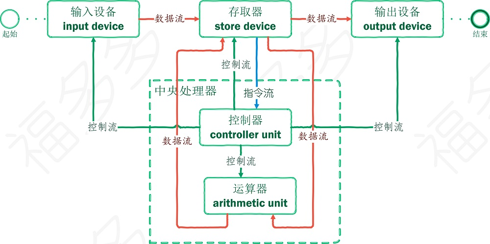

# 福福福
-------------------------------------------------------------------------------------------

## 冯诺依曼计算机结构

-------------------------------------------------------------------------------------------

* [线程生命周期（thread lifecycle）](thread)

* [线程池的执行流程（thread pool execute flow）](threadPool)

* [网络模型（network model）](network.md)