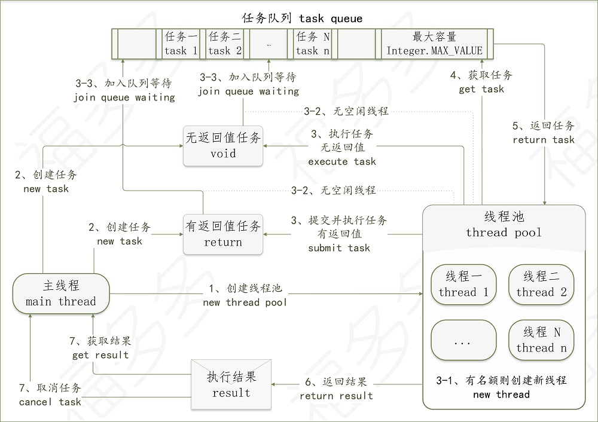

# 福福福

-------------------------------------------------------------------------------------------
## 线程池的执行流程（thread pool execute flow）

-------------------------------------------------------------------------------------------

[首页](/)